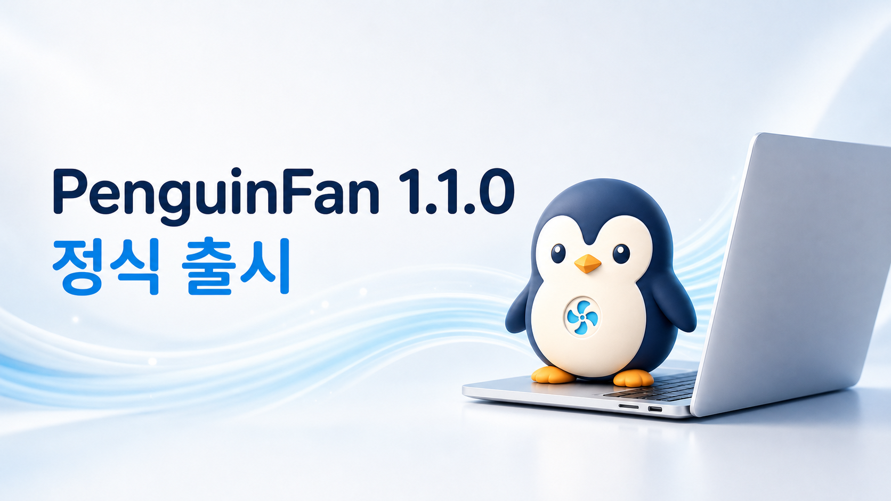
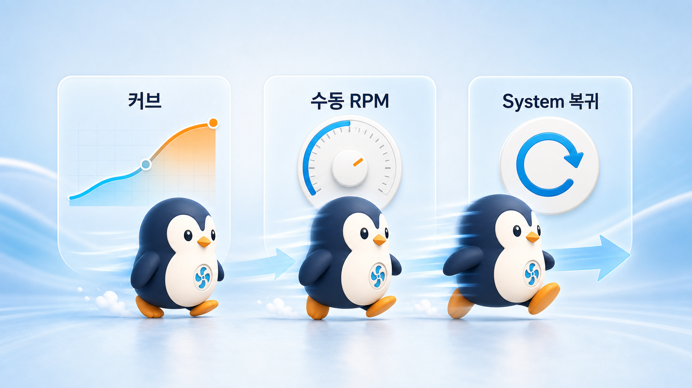

# 네이버 블로그 게시용: PenguinFan 1.1.0 정식 출시

## 추천 제목

**맥북 팬을 온도에 맞게 자동 조절하는 무료 앱, PenguinFan 1.1.0 정식 출시**

## 대체 제목

- M2 Max 맥북 팬 속도를 직접 관리하는 PenguinFan 정식판 공개
- 팬 속도에 따라 펭귄이 걷는다? 무료 메뉴바 앱 PenguinFan 1.1.0
- osascript 암호창 없이 팬을 제어하는 PenguinFan 업데이트

---

안녕하세요.

직접 만들고 실제 M2 Max MacBook Pro에서 테스트해 온 무료 팬 컨트롤러
**PenguinFan이 1.1.0 정식 버전**으로 공개됐습니다.

PenguinFan은 메뉴바에서 맥의 온도와 듀얼 팬 RPM을 확인하고, 온도에 따라
팬 속도를 자동 조절하거나 원하는 RPM을 직접 지정할 수 있는 네이티브 macOS
앱입니다. 개인 사용자뿐 아니라 누구나 소스를 살펴보고 수정할 수 있도록
**MIT 라이선스의 무료 오픈소스**로 배포합니다.

## 1.1.0에서 가장 크게 달라진 점

이전 버전에서는 실제 팬 제어를 시작할 때 `osascript` 이름으로 관리자 암호
창이 나타날 수 있었습니다. 1.1.0에서는 이 방식을 제거하고 macOS의
`SMAppService` LaunchDaemon과 권한 분리 XPC 구조를 사용합니다.

팬 제어 권한이 필요한 작업은 별도의 서명된 헬퍼가 담당하고, 앱과 헬퍼는
실행 파일 경로, 코드 서명 식별자, Team ID, 로그인 사용자까지 확인한 후에만
연결됩니다. 사용자 입장에서는 불필요한 암호창이 줄고, 내부적으로는 제어
경로가 더 명확해졌습니다.

## 세 가지 팬 제어 모드

**시스템 모드**

macOS가 팬을 자동으로 제어합니다. 앱을 종료하거나 문제가 발생했을 때도 이
상태로 돌아가도록 설계했습니다.

**커브 모드**

온도가 올라갈수록 목표 RPM이 자연스럽게 높아집니다. 평소에는 조용하게,
부하가 커지면 적극적으로 냉각하고 싶은 경우에 적합합니다.

**수동 모드**

팬 RPM을 사용자가 직접 지정합니다. 지정 가능한 값은 실제 팬의 안전 범위
안으로 제한됩니다.

메뉴바의 작은 펭귄도 팬 속도에 맞춰 걷는 속도가 달라집니다. 숫자를 계속
보지 않아도 현재 냉각 상태를 가볍게 확인할 수 있도록 넣은 PenguinFan만의
작은 특징입니다.

## 실제 M2 Max에서 확인했습니다

`Mac14,6` M2 Max MacBook Pro에서 커브 모드를 테스트했습니다.

- 측정 온도: 약 78도
- 커브 목표: 4,873 RPM
- Fan 1 반응: 4,922 RPM
- Fan 2 반응: 4,921 RPM
- 시스템 자동 제어 복귀: 성공
- 권한 헬퍼 정상 종료: 확인

또한 앱과의 연결이 끊기거나 하트비트가 사라지면 6초 watchdog이 팬 제어를
macOS 시스템 모드로 복구합니다.

## 다운로드와 설치

GitHub 릴리즈 페이지에서 `PenguinFan-1.1.0.pkg`를 다운로드할 수 있습니다.

다운로드:
https://github.com/pmh10401/PenguinFan/releases/latest

소스 코드:
https://github.com/pmh10401/PenguinFan

설치 후 응용 프로그램 폴더의 `PenguinFan.app`을 실행하면 메뉴바에 펭귄
아이콘이 나타납니다. 커브 또는 수동 모드를 처음 사용할 때 macOS가 로그인
항목 및 확장 프로그램 승인을 요청할 수 있습니다.

## 설치 전 꼭 확인해 주세요

현재 1.1.0은 Apple Development 인증서로 서명됐지만 Apple 공증은 아직 받지
않았습니다. Gatekeeper가 차단하면 다운로드 출처를 확인한 뒤 **시스템 설정
> 개인정보 보호 및 보안 > 확인 없이 열기**를 사용해야 할 수 있습니다.

실제 팬 제어는 하드웨어에 영향을 줄 수 있습니다. 현재 실기기 검증 대상은
M2 Max `Mac14,6`이며, 다른 Apple Silicon 모델은 SMC 키와 팬 범위가 다를 수
있어 지원 대상에 포함하지 않았습니다.

## 무료인가요?

네. PenguinFan은 **완전 무료**이며 광고나 유료 기능 잠금이 없습니다.
MIT 라이선스 오픈소스이므로 개인과 회사 모두 무료로 사용하고, 코드를
검토하거나 수정해 다시 배포할 수 있습니다.

직접 사용해 보시고 문제가 있거나 지원했으면 하는 Mac 모델이 있다면 GitHub
Issues에 알려주세요. 실제 하드웨어 정보와 함께 제보해 주시면 지원 범위를
안전하게 넓히는 데 큰 도움이 됩니다.

#맥북 #맥북프로 #M2Max #팬컨트롤 #맥팬속도 #맥발열 #메뉴바앱
#무료앱 #오픈소스 #PenguinFan #macOS앱 #개발기
