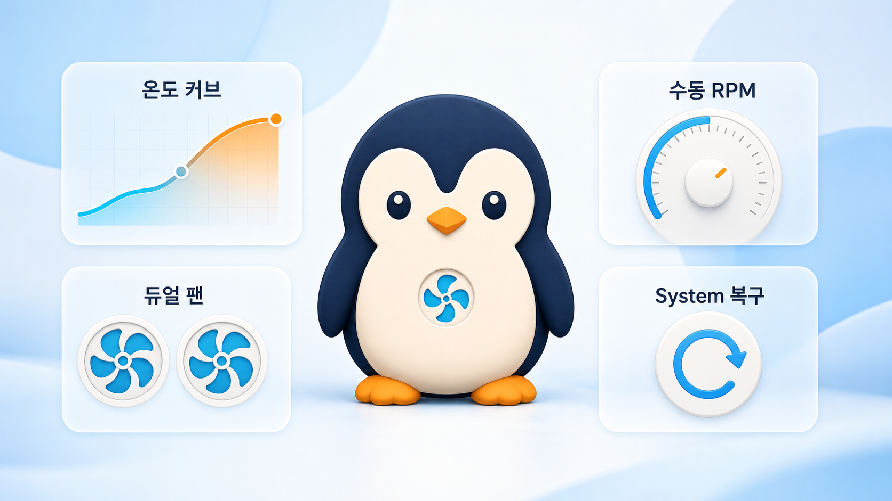

# PenguinFan 네이버 블로그 홍보 글 - v1.2.2

## 제목 후보

1. **맥 발열과 팬 소음을 직접 관리하는 무료 앱, PenguinFan을 만들었습니다**
2. 맥 팬 속도를 온도에 맞게 조절하는 무료 오픈소스 앱 PenguinFan
3. 팬 속도에 따라 펭귄이 걷는다? M2 Max 맥 메뉴바 앱 PenguinFan

**추천 제목:** 맥 발열과 팬 소음을 직접 관리하는 무료 앱, PenguinFan을 만들었습니다

---

안녕하세요. M2 Max MacBook Pro를 사용하면서 발열과 팬 소음을 조금 더
직관적으로 확인하고 싶어, 메뉴바에서 동작하는 작은 팬 관리 앱
**PenguinFan**을 만들었습니다.

PenguinFan은 무료 오픈소스 앱입니다. 온도와 듀얼 팬 RPM을 확인하고,
원하는 경우 온도에 맞춘 팬 커브 또는 고정 RPM을 적용할 수 있습니다.
언제든지 **System** 모드로 돌아가면 macOS의 기본 자동 팬 제어를 다시
사용합니다.

## 무엇을 할 수 있나요?

- 메뉴바에서 현재 최대 온도와 팬 RPM을 빠르게 확인
- 온도에 따라 RPM이 변하는 **Curve 모드** 설정
- 원하는 RPM을 직접 입력하는 **Manual 모드** 설정
- 첫 커브 포인트보다 낮은 온도에서는 macOS 자동 제어 유지
- 팬 속도에 맞춰 걷는 속도가 달라지는 귀여운 펭귄 메뉴바 아이콘
- 한 번의 클릭으로 System 모드로 복귀

## 펭귄이 걷는 속도도 팬 속도에 맞춰집니다

PenguinFan은 정보를 숫자로만 보여 주지 않고, 팬이 빨라질수록 메뉴바의
펭귄이 조금 더 빠르게 걷도록 만들었습니다. 작업 중에도 지금 맥이 얼마나
열심히 식고 있는지 자연스럽게 알 수 있는 작은 표시입니다.

## v1.2.2에서 개선한 점

이번 정식 릴리즈에서는 설치 뒤 Curve 모드가 동작하지 않던 문제를 집중적으로
보완했습니다.

- `/Applications` 안의 로컬라이즈드 폴더 및 심볼릭 링크 설치 경로에서도
  권한 제어가 정상 동작하도록 개선했습니다.
- 앱 업데이트 과정에서 이미 승인한 권한 서비스가 해제되지 않도록 보완했습니다.
- 온도 센서 값이 잠시 비어도 Curve 모드가 즉시 해제되지 않고, 이전의 안전한
  제어 값을 유지하도록 개선했습니다.
- 실제 `Mac14,6` M2 Max에서 약 `81.5 C`일 때 목표 `5063 RPM`이 적용되고,
  두 팬이 약 `5065 / 5048 RPM`으로 반응하는 것을 확인했습니다.

전체 자동 테스트 `110개`와 서명된 설치 패키지 검증도 마쳤습니다.

## 다운로드와 설치

최신 버전은 GitHub Releases에서 받을 수 있습니다.

- 릴리즈 페이지: <https://github.com/pmh10401/PenguinFan/releases/tag/v1.2.2>
- 설치 파일: `PenguinFan-1.2.2.pkg`

설치 후 `/Applications/PenguinFan.app`을 실행하세요. Curve 또는 Manual
모드를 처음 선택할 때만 macOS가 권한 서비스 승인을 요청할 수 있습니다.
승인 화면이 나타나면 **시스템 설정 > 일반 > 로그인 항목 및 확장 프로그램**에서
PenguinFan을 허용하면 됩니다.

Apple Development 인증서로 서명한 패키지이지만, 아직 Apple 공증은 받지
않았습니다. 다른 Mac에서 Gatekeeper가 실행을 막는다면, 다운로드를 신뢰하는
경우 **시스템 설정 > 개인정보 보호 및 보안 > 확인 없이 열기**를 선택할 수
있습니다.

## 무료 오픈소스입니다

PenguinFan은 MIT 라이선스로 공개했습니다. 개인용과 상업용 모두 무료이며,
코드를 살펴보고 수정하거나 개선 제안을 보내는 것도 환영합니다.

## 사용 전 안내

현재 실제 하드웨어 검증은 `Mac14,6` M2 Max MacBook Pro를 기준으로 했습니다.
다른 Apple Silicon 모델은 SMC 키와 팬 RPM 범위가 다를 수 있습니다. 직접 팬
제어는 냉각, 소음, 부품 온도 및 하드웨어 수명에 영향을 줄 수 있으므로, 충분히
확인한 뒤 사용해 주세요.

문제 제보와 개선 아이디어는 GitHub Issues로 남겨주시면 확인하겠습니다.

감사합니다.
